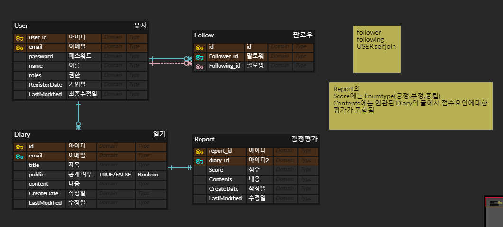
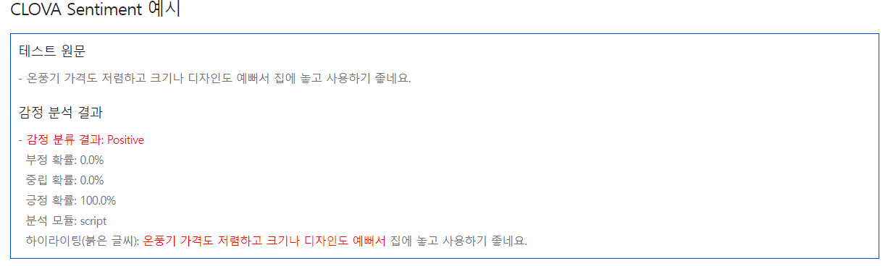

## MOY : Memory Of Yesterday

---

> 💡 - 꾸준히 작성하는 다이어리 . 서비스

## 해결하고자하는 목표/ 서비스 ✨

```
1. 글쓰기 습관을 들이기
- 북스터디 블로그 글쓰기를 할때 블로그에 몇번 글을 작성해 보았기에 크게 부담스럽지않았지만
처음 글을쓸떄 ( 글쓰기 습관이 없었을때 )  무엇을 쓸지, 어떻게 쓸지, 고민이 많았던 때를 기억하며
사용자들로 하여금 평소에 글을 작성(기록)하는 습관을 들일수 있도록 하고자 합니다.

2. 일기 서비스
- 요즘엔 과거의 나는 어떤사람이였나 생각을 많이 한다. 이 프로젝트가 지금 그떄의 자신을 회상하게하는
계기를 제공하고자 합니다.

3. 자신의 감정 마주하기 : Sentiment-Check 구현
- 우리는 놀랍도록 타인의 감정변화에는 민감하지만 대다수의 사람들은 자신의 감정에 솔직하지못한 경우가
많은것 같습니다. 해당 프로젝트 서비스를 이용함으로써 작성글에대한 자신의 감정을 마주보게합니다.
```

## 기술스택 :

- Spring (2.x)
- SpringBoot
- Java 11
- Docker
- Mysql
- Redis
- ElasticSearch

## 사용 라이브러리:

- Swagger (Api doc)
- jwt(Json web token)
- JDBC(Mysql)
- Spring-data-JPA
- Spring-Security
- Spring-Web
- Spring-WebFlux
- Lombok(Annotation)

## 요구사항 및 기능설계

### 사용자(User)

- 회원가입 [ ]
    - 이메일을 ID로 하며 이메일당 한계정만 가능합니다.(Unique)
- 로그인 [ ]
    - 특정 기능에 접근하려면 로그인해야합니다.
    - 사용자는 회원가입에 사용했던 아이디와 패스워드로 로그인 할수 있습니다.
- 로그아웃 [ ]
    - 사용자 로그아웃
- 팔로우 [ ]
    - 사용자는 다른 사용자를 팔로우할수있으며 각 사용자는 팔로워와 팔로잉이 등록됩니다.
- 피드 [ ]
    - 사용자의 팔로잉하는 유저의 최근 글들을 목록화 해서 가져옵니다.
    

### 다이어리(Diary)

- 글작성 [ ]
    - 로그인상태에서만 작성가능합니다.
    - 사용자는 제목,내용 으로 글을 작성할수있습니다.
- 글수정/삭제 [ ]
    - 로그인 정보와 해당 글의 작성자를 비교하며 같을경우 삭제/수정 처리합니다.
- 특정 글 조회 기능 [ ]
    - 자신의 글은 제한이 없으나 타인의 글을볼경우 public 상태일 경우 볼수있습니다.
- Public 글 조회 기능 [ ]
    - 로그인이 선행되어야합니다.
    - 글 중 작성일을 기준으로  공개한(Public) 글을 목록화해서 가져옵니다.
    - 글이 충분히 많을수 있으므로 페이징 처리한다.
- 검색기능  [ ]
    - Public 글중 검색 키워드에따른 정확도, 유사도를 측정하여 해당하는 글목록을 가져옴
    - 글이 충분히 많을수 있으므로 페이징 처리함


## 감정보고서(Report)

- 작성: [ ]
    - 외부 API로 작동하며 사용자가 직접 제어할수 없습니다.
    - Diary 글이 작성/수정 되면 Report 또한 작성/수정 됩니다
    - 보고서에는 다음과같은내용이 포함된다.
    - 감정 (긍정,부정,중립)
    - 감정에 대한확률
    - 감정에 점수를 주는 요인(특정 단어)
    - Naver CLOVA Sentiment Example 이미지를
- 열람: [ ]
    - 로그인이 선행되어야합니다.
    - 보고서의 원본글에 대해 작성자만 열람가능합니다.

- 보고서 모아보기: [ ]
    - 로그인이 선행되어야합니다.
    - 자신의 글에대한 보고서를 목록화해서 보여줌
    - 충분히 많을수 있으므로 페이징 처리함

---

## ERD

ERDCLOUD: [링크](https://www.erdcloud.com/d/qKP47RGWdwnbKqzRG)  


SentimentApi: 
